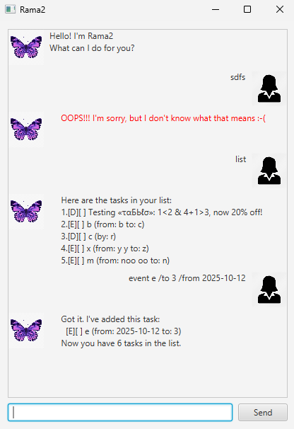

# Rama2 User Guide




Rama2 ([_rama-rama_](https://en.m.wiktionary.org/wiki/rama-rama)) means _butterfly_ in Malay.

> Butterflies can be pretty
>
> -somebody 

## Adding todo

Adds a todo to the list of tasks.

Example: `todo <name>`
```
> todo laundry
     Got it. I've added this task:
       [T][ ] laundry
     Now you have 6 tasks in the list.
```


## Adding deadlines

Adds a deadline to the list of tasks.

`deadline <name> /by <datetime>`

Example: 
```
> deadline week6 laundrys /by Thu
     Got it. I've added this task:
       [D][ ] week6 laundrys (by: Thu)
     Now you have 8 tasks in the list.

```


## Adding events

Adds an event to the list of tasks.

Example: `event <name> /from <datetime>  /to <datetime>`   (`/from` and `/to` can be swapped.)
```
> event Dentist /from 3pm /to 5pm
     Got it. I've added this task:
       [E][ ] Dentist (from: 3pm to: 5pm)
     Now you have 9 tasks in the list.
```

## List tasks

Lists tasks.

`list`
```
> list
     Here are the tasks in your list:
     1.[D][ ] week6 iP (by: Thu)
     2.[T][ ] laundry
     3.[D][ ] week6 laundrys (by: Thu)
     4.[E][ ] Dentist (from: 3pm to: 5pm)
```

## Find tasks

Find an task by part of its name

Example: `find <search string>`
```
> find laundry
     Here are the tasks in your list:
     1.[T][ ] laundry
     2.[D][ ] week6 laundrys (by: Thu)
```

## Mark an task done

Mark an task as done, will be shown as `[X]`

Example: `mark <task number in list>`
```
> mark 3
     Nice! I've marked this task as done:
       [D][X] week6 laundrys (by: Thu)

> list
     Here are the tasks in your list:
     1.[D][ ] week6 iP (by: Thu)
     2.[T][ ] laundry
     3.[D][X] week6 laundrys (by: Thu)
     4.[E][ ] Dentist (from: 3pm to: 5pm)

```

## Mark an task __not__ done

Mark an task as done, will be shown as `[ ]`

Example: `unmark  <task number in list>`
```
> unmark 3
     OK, I've marked this task as not done yet:
       [D][ ] week6 laundrys (by: Thu)

> list
     Here are the tasks in your list:
     1.[D][ ] week6 iP (by: Thu)
     2.[T][ ] laundry
     3.[D][ ] week6 laundrys (by: Thu)
     4.[E][ ] Dentist (from: 3pm to: 5pm)

```

## Exit

Mark an event as done, will be shown as `[X]`

`bye `
```
> bye
     Bye. Hope to see you again soon!
```

## Saving and Loading
The program automatically saves to `Rama2.txt` after every change, and loads from there before startup if it is available.

## Fat self-contained (JavaFX-containing) Jar file
Available at `build\libs\ramarama.jar`

<!--## Command-Line Interface
The program has a command-line interface too:
```
list
     Here are the tasks in your list:
     1.[D][ ] Testing «τα???σ»: 1<2 & 4+1>3, now 20% off!        
     2.[E][ ] b (from: b to: c)
     3.[D][ ] c (by: r)
     4.[E][ ] x (from: y y to: z)
     5.[E][ ] m (from: noo oo to: n)
     6.[E][ ] e (from: 2025-10-12 to: 3)

deadline laundry /by 2025-10-03
     Got it. I've added this task:
       [D][ ] laundry (by: Oct 3 2025)
     Now you have 7 tasks in the list.

list
     Here are the tasks in your list:
     1.[D][ ] Testing «τα???σ»: 1<2 & 4+1>3, now 20% off!
     2.[E][ ] b (from: b to: c)
     3.[D][ ] c (by: r)
     4.[E][ ] x (from: y y to: z)
     5.[E][ ] m (from: noo oo to: n)
     6.[E][ ] e (from: 2025-10-12 to: 3)
     7.[D][ ] laundry (by: Oct 3 2025)
```-->
